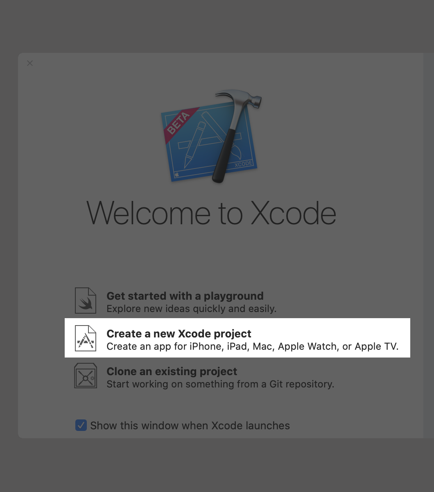
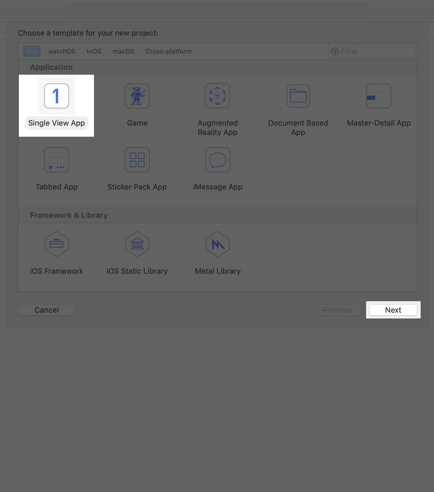
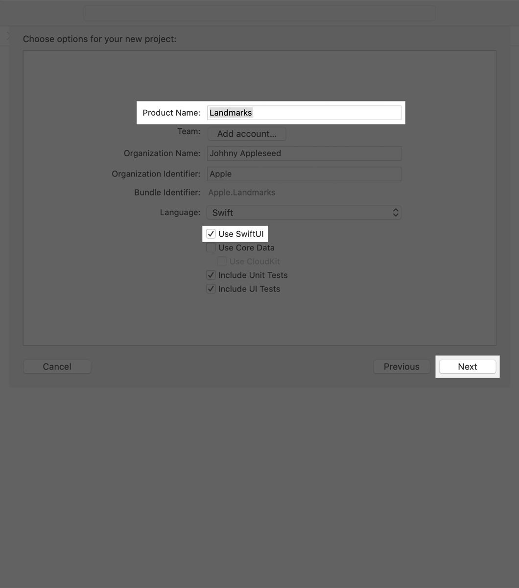
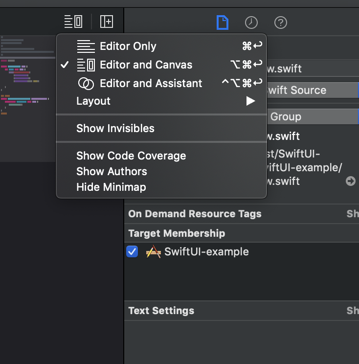
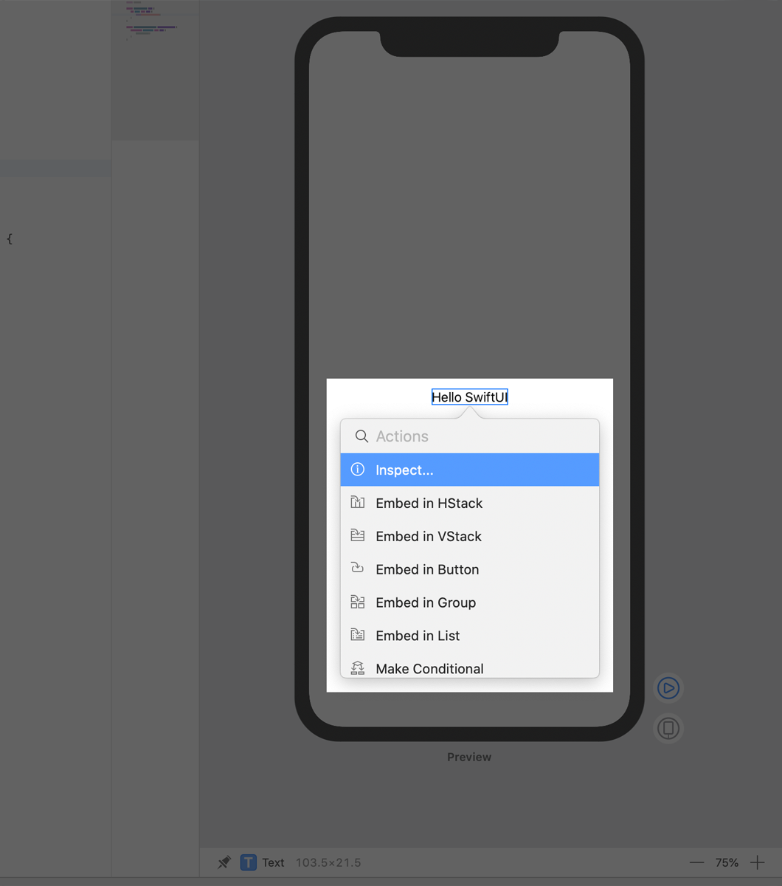
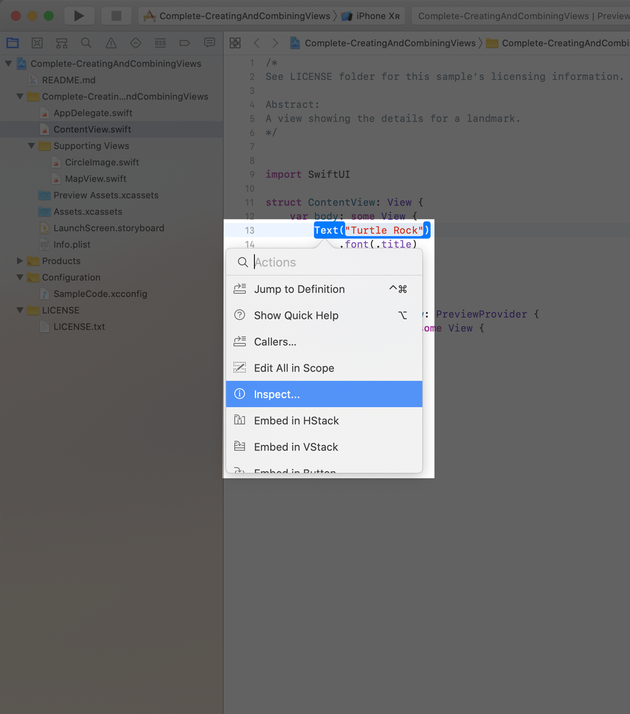

# SwiftUI examples

苹果与2019年6月4日发布的全新UI框架旨在统一苹果各平台的UI(包括UIKit ，AppKit...)，这是一些例子(包含部分来自官方的教程)。
在开始之前，你需要如下准备

| 工具  | 是否必须 |
| --- | --- |
| [Xcode 11 beta](https://developer.apple.com/download/)  |  ✅  |
| mac OS Mojave or Higher  |  ❎ |

(如果想要体验实时预览和完整的Xcode 11 功能，需要macOS 10.15 beta)


开始第一个demo
1.创建新的项目，并勾选使用SwiftUI

|  |  |  |
| --- | --- | --- |

2.打开`ContentView.swift`文件，文件内容如下
```swift
import SwiftUI

struct ContentView: View {
    var body: some View {
        Text("Hello SwiftUI")
    }
}
#if DEBUG
struct ContentView_Previews: PreviewProvider {
    static var previews: some View {
        ContentView()
    }
}
#endif
```
如果使用的是macOS 10.15 beta 版本的系统则可以打开实时预览页面

(如果是macOS 10.14打开也只有源代码编辑界面)
修改UI只需要按住command点击对应了的UI控件(或代码)编辑即可如下图：（macos 10.14不会弹出此菜单），修改预览中路那个的属性会直接自动同步更新源代码，更改代码会更新预览视图

|  |  |
| --- | --- |

3.修改代码实现自定义视图（点击源码中Text跳转到定义，查看SwiftUI定义的所有控件代码约1W行 ）示例代码
```swift
//
//  ContentView.swift
//  SwiftUI-example
import SwiftUI
struct ContentView: View {
    var body: some View {
        // 创建 文本（Label）
        let aText = Text("Hello SwiftUI")
            .color(.yellow)
            .strikethrough()
            .font(.system(size: 14.1))

        // 创建 按钮（Button）
        let aButton = Button(action: {
            print(#function)
        }) {
            Text("Hello SwiftUI")
        }

        let aView = AnyView(aText)

        // 创建图片
        let anImage = Image("img")
            .aspectRatio(contentMode: .fit)

        // 布局各视图
        return VStack {
            anImage
            aText
            aButton
            aView
        }
    }
}
#if DEBUG
struct ContentView_Previews: PreviewProvider {
    static var previews: some View {
        ContentView()
    }
}
#endif
```


更多官方示例源码：
1. [创建和组合视图(Creating and Combining Views)](https://developer.apple.com/tutorials/swiftui/creating-and-combining-views)
2. [列表和导航栏(Building Lists and Navigation)](https://developer.apple.com/tutorials/swiftui/building-lists-and-navigation)
3. [处理用户事件(Handling User Input)](https://developer.apple.com/tutorials/swiftui/handling-user-input)

4. [绘图路径和形状(Drawing Paths and Shapes)](https://developer.apple.com/tutorials/swiftui/drawing-paths-and-shapes)
5. [动画和转场(Animating Views and Transitions)](https://developer.apple.com/tutorials/swiftui/animating-views-and-transitions)
6. [复杂界面组合(Composing Complex Interfaces)](https://developer.apple.com/tutorials/swiftui/composing-complex-interfaces)
7. UIKit混合开发[(Interfacing with UIKit)](https://developer.apple.com/tutorials/swiftui/interfacing-with-uikit)&[(Working with UI Controls)](https://developer.apple.com/tutorials/swiftui/working-with-ui-controls)

如果你想了解更多关于SwiftUI的内容，你可以通过以下途径获取

1. [SwiftUI Apple 官方教程](https://developer.apple.com/tutorials/swiftui/creating-and-combining-views)
2. [SwiftUI Apple Documentation](https://developer.apple.com/documentation/swiftui)
3. [WWDC19 SwiftUI](https://developer.apple.com/videos/play/wwdc2019/238/)
4. [Xcode SwiftUI Source](./SwiftUI-example/SwiftUI-example/SwiftUI.swift)